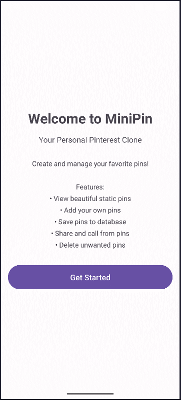

# MiniPin - Personal Pinterest-Style Android App

MiniPin is a simple Android app (Java) where users can browse static pins, create their own pins, save them locally, view details, share content, and delete saved items.  
It is designed as a clean learning project for core Android concepts like Activities, Intents, SQLite, SharedPreferences, and Notifications.

---
### GIF Demo


---

## Features

- Browse static pin cards on the home screen
- Add and save your own pins locally
- View saved pins from the database
- Open pin details with share and call actions
- Delete saved pins with confirmation
- Show a welcome screen for first-time users
- Send a notification when a new pin is saved


---

## Project Structure

```text
minipin/
├── build.gradle.kts
├── settings.gradle.kts
├── gradle/
│   ├── libs.versions.toml
│   └── wrapper/
├── app/
│   ├── build.gradle.kts
│   ├── proguard-rules.pro
│   └── src/
│       ├── main/
│       │   ├── AndroidManifest.xml
│       │   ├── java/com/example/minipin/
│       │   │   ├── MainActivity.java          # Home screen + first-launch logic
│       │   │   ├── WelcomeActivity.java       # Welcome/intro screen
│       │   │   ├── AddPinActivity.java        # Add/save pin + notifications
│       │   │   ├── ViewPinsActivity.java      # Display/delete saved pins
│       │   │   ├── DetailActivity.java        # Pin details + share/call actions
│       │   │   ├── PinDatabaseHelper.java     # SQLite helper (CRUD)
│       │   │   └── Pin.java                   # Pin data model
│       │   └── res/
│       │       ├── layout/                    # Activity and item XML layouts
│       │       ├── drawable/                  # UI backgrounds and vector assets
│       │       ├── values/                    # strings, colors, themes
│       │       └── xml/                       # backup/data extraction rules
│       ├── test/
│       └── androidTest/
└── README.md
